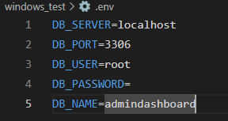
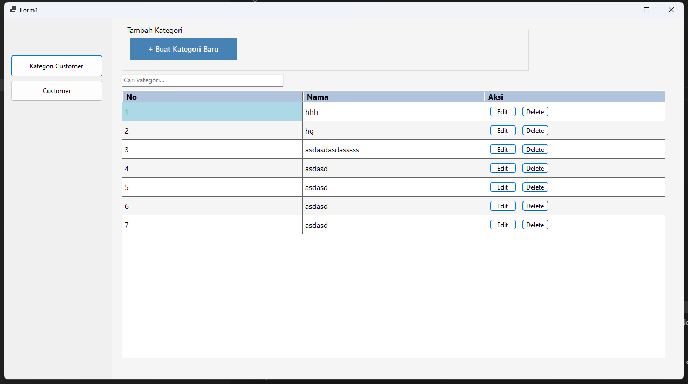
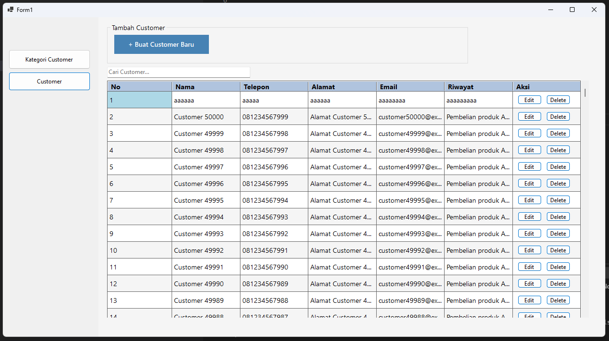
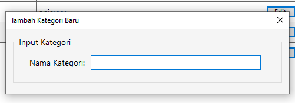
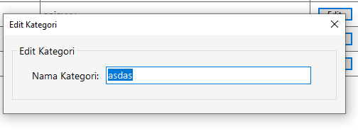
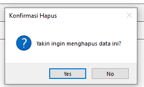

# C# Dashboard UMKM (BETA)

Aplikasi dashboard berbasis C# untuk pengelolaan data UMKM, khusus dikembangkan untuk admin aplikasi utama: dashboardumkm.

## Persyaratan Sistem

Sebelum menjalankan aplikasi, pastikan Anda telah menginstal dependensi berikut:

- Database: MySQL atau MariaDB

- NuGet Packages:

* DotNetEnv versi 3.1.1

* MySql.Data versi 9.2.0

## Konfigurasi Database

Duplikat file `.env.example` menjadi `.env`.

Ubah isi file `.env` sesuai konfigurasi database Anda

# 🖼️ Tampilan Antarmuka (UI Preview)

## Kategori Data

## Customer Data

## sample create data

## sample edit data

## sample delete data

