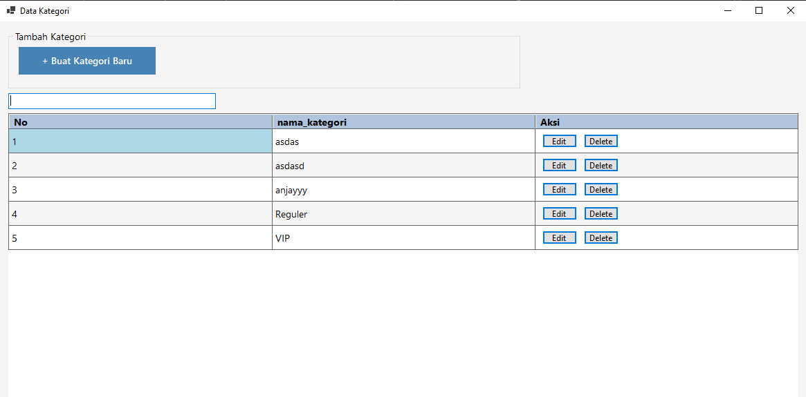

# C# DASHBOARD UMKM

pengembangan for admin aplikasi https://github.com/sukmaajidigital/dashboardumkm

## REQUIRE FOR RUNNING

- MySQL or Mariadb DBMS
- `"DotNetEnv" Version="3.1.1"`
- `"MySql.Data" Version="9.2.0"`

## sample data

## sample create data

## sample edit data

## sample delete data

